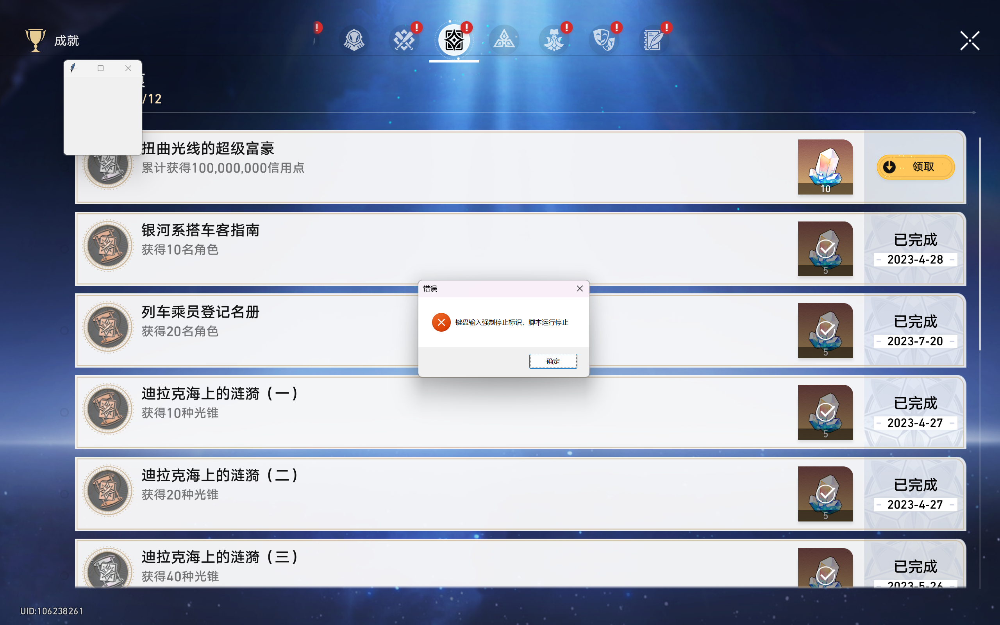
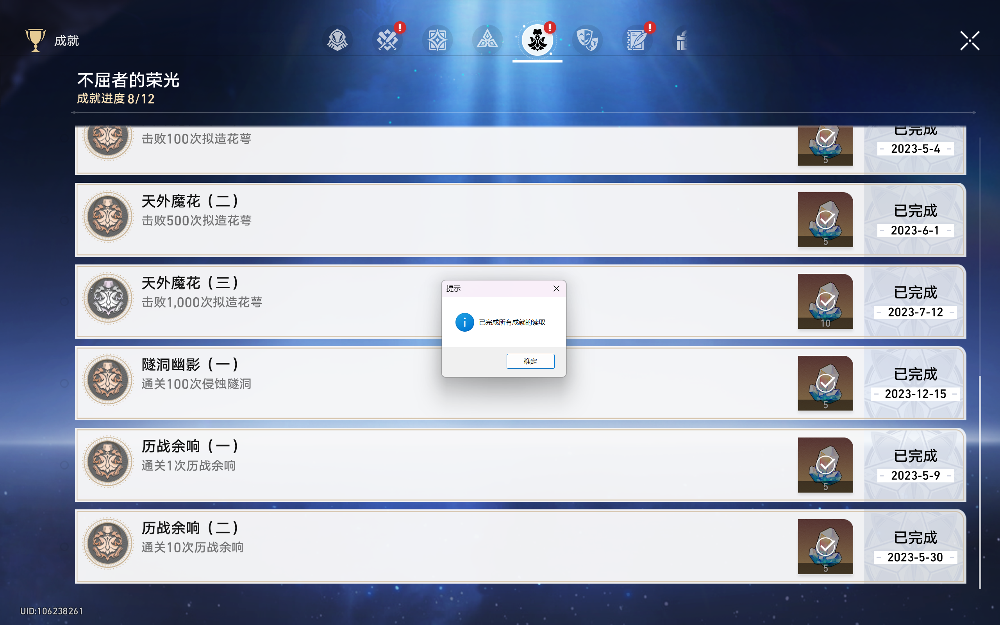
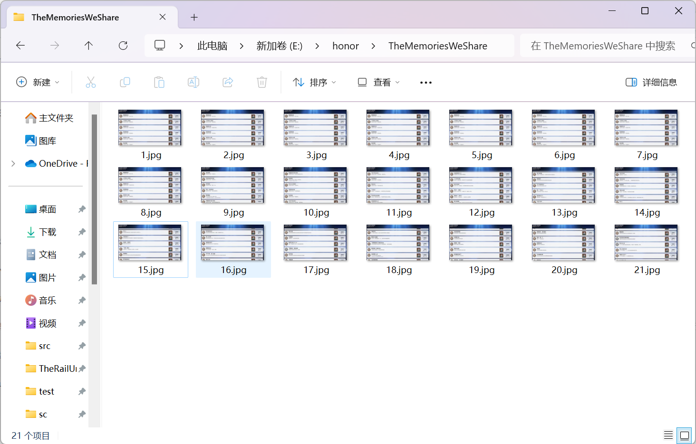
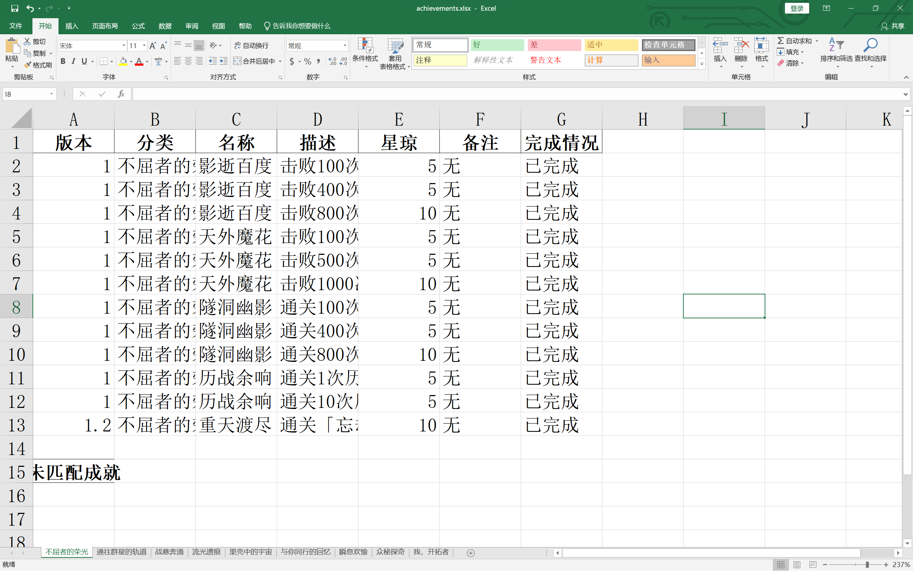

# starRailScanner——基于pyautogui的崩坏星穹铁道成就扫描脚本

## 项目迭代记录

- 2024-08-16
  - 更新成就全集爬虫，目前支持中文，英文，日语三种语言的爬取。
  - 更新README文档框架，添加爬虫部分的使用介绍。
  - 修复匹配即完成的bug，提高识别准确性。
  - 编写英语版本的README文件。


- 2024-08-15
  - 修复创建文件目录时的函数以及判断错误。


- 2024-08-12
  - 成就全集文件迭代，由2.2版本迭代至2.4版本。
  - ~~更新预告1：成就全集爬虫正在开发中，将在下个版本测试上线。~~（已完成）
  - 更新预告2：正在学习打包.exe文件，后续版本将发布release版本的.exe文件。
  - 停更预告：由于笔者正在备考，所以后续更新进程可能较长，在此抱歉。


- 2024-05-28

  - 完成对2560\*1600类型设备的英语识别支持。
  - 修改selector部分代码降低识别过程中的遗漏概率。
  - 修改项目框架以适应于未来多语言支持，同时修改config以及README相关表述。


- 2024-05-19

  - 成就全集文件迭代，由2.1版本迭代至2.2版本。
  - 修复了由于github不允许空文件夹上传以及创建导致的路径图片数量检测未通过的问题。
  - 修改了README中关于imgs文件夹架构的表述。


- 2024-04-18

  - 成就全集文件迭代，由2.0版本迭代至2.1版本。
  - 完成项目对1920*1080类型设备的匹配。
  - 完成项目多线程实现强制停止操作。


- 2024-04-02 
  项目框架完成，第一次代码提交，同步完成项目说明文档并提交


## 目录
  * [简介](#简介)
  * [适用范围](#适用范围)
  * [项目结构](#项目结构)
  * [使用方法](#使用方法)
    * [环境配置](#环境配置)
    * [版本检查](#版本检查)
    * [参数设置](#参数设置)
    * [运行脚本](#运行脚本)
    * [运行结果](#运行结果)
  * [常见问题&amp;问题反馈](#常见问题问题反馈)
  * [未来计划](#未来计划)
  * [特别鸣谢](#特别鸣谢)

## 简介

本脚本旨在通过pyautogui进行的模拟键鼠操作以及pytesseract提供的文本识别功能实现对崩坏 星穹铁道游戏中的成就列表的提取与整理。由于笔者前端实现能力较差（其实是比较懒）， 故而脚本通过python编译器在控制台中运行。

该项目此前曾提交过一个版本（~~但是已经被设置为private~~）,故而该版本提交为该项目的version 2.0。相较于原版本中完成所有成就读取才进行成就匹配的操作，该版本修正为完成部分成就（一般为5个）的读取后即进行成就的匹配，在一定程度上降低了内存的使用量。

项目灵感主要来源于[@椰羊CoCoGoat](https://github.com/YuehaiTeam/cocogoat)以及[@HertaSpace](https://github.com/YuehaiTeam/herta.space))，在此表示感谢。但是笔者希望可以通过本地操作避免视频数据或者批量图片的上传从而减轻网络负担，故而萌生了编写本地化脚本的想法。在椰羊CoCoGoat的启发下选择使用模拟键鼠操作进行截图处理并且使用文字识别从而完成图片中成就的读取。同时通过对静态化的图片而非视频进行ocr操作希望可以在一定程度上提高文字识别的精度。

## 适用范围

-[x] 2560\*1600 for Chinese

-[x] 2560\*1600 for English

-[X] 1920\*1080 for Chinese

-[X] 1920\*1080 for English

-[ ] 3840\*2160 for Chinese

-[X] 3840\*2160 for English

由于笔者使用的PC设备的分辨率为2560\*1600，同时未对其余分辨率进行测试，故而当前该脚本可以适配的分辨率为2560\*1600，后续经过测试后将适配3840\*2160以及1920\*1080等PC端设备。

笔者在代码中普遍采用相对位置坐标进行编码，故而在截图点位选择上不会出现较大的变动，主要需要适配的数据包括在使用pyautogui提供的scroll函数时鼠标滚轮的次数。

以上提到的数据均在保存在config.py中，各位开拓者可以根据使用的PC端配置进行相应的修改或等待脚本的更新。

## 项目结构

项目中主要包含脚本编码文件以及当前版本的全成就列表（以.xlsx形式存储），下面为对各代码文件的简单描述。

|             文件名称              |                             描述                             |
| :-------------------------------: | :----------------------------------------------------------: |
|           achievements            |                 用于存储读取完成时的成就列表                 |
|        achievementSet_full        |        用于存储全成就列表，其中包含脚本目前支持的语言        |
|          checkPoints.py           |    用于检测脚本运行环境，包括是否配置相关包以及设备分辨率    |
|             config.py             |  用于存储脚本运行相关参数，包括截图位置以及鼠标滚轮操作次数  |
|             crawl.py              |                  用于从网页端更新全成就列表                  |
|         excelOperation.py         |       用于存储excel相关操作，包括excel读写以及列宽操作       |
|        KeyboardListener.py        |    引入键盘监听组件pynput用于监听键盘端输入，停止脚本操作    |
|              Main.py              |            项目运行入口，组织并调用相应的函数操作            |
|              ocr.py               |             配置项目附带的pytesseract的调用参数              |
|           operation.py            |  pyautogui库相关操作，包括鼠标移动，鼠标滚轮滚动以及截图等   |
|            process.py             |   根据游戏操作逻辑进行成就集切换，并且连通ocr以及截屏操作    |
|            selector.py            |        基于cv2进行的成就逐条提取并保存为图片以供识别         |
|  achievementSet_full/x.x_().xlsx  |         全成就列表，以版本号命名，括号中为对应的语言         |
| achievements/achievements_().xlsx | 读取完成产生的成就列表，括号中为读取时的语言（**读取完成后产生**） |
|             tesseract             | 存储tesseract库的组件（若在本地存在配置可以不下载该文件夹）  |

同时项目中包含一个名为imgs的文件夹用于存储截图过程中产生的成就图片，各位开拓者可以在config.py中将save_img设置为True以保存产生的截图以共上传到其他的成就在线读取工具中进行识别，或者选择将其设置为False，截图产生的图片将会在完成识别后被删除。imgs中的存在对应于成就集的文件夹，由于成就集“我，开拓者”中逗号的存在到导致python在识别时产生错误编码的问题，故而采用英文命名。下面给出成就中文与图片存储文件夹的对照表。

| 成就集（中文） | 存储文件夹（英文） |
| :------------: | :---------------------------------------------------------: |
| temp | temp |
| 不屈者的荣光 | GloryOfTheUnyielding |
| 与你同行的回忆 | TheMemoriesWeShare |
| 众秘探奇 | FathomTheUnfathomable |
| 我，开拓者 | Trailblazer |
| 战意奔涌 | EagerForBattle |
| 果壳中的宇宙 | UniverseInANutshell |
| 流光遗痕 | VestigeOfLuminflux |
| 瞬息欢愉 | MonmentOfJoy |
| 通往群星的轨道 | TheRailUntoTheStar |

注：temp目录主要用于暂时存储对于成就集中文的截图图片用于判断究竟处在什么成就集下并将图片保存至对应的文件夹中。

## 使用方法

### 环境配置

脚本基于pyhon3.9进行开发，在使用前需要检查python版本以避免无法使用。项目提供了相应的requirements.txt用于描述脚本使用的相关python库文件，使用前需要配置到运行环境中。

（由于调用的库较多，推荐使用anaconda或者miniconda等虚拟环境进行配置）

若使用pip直接安装或者在虚拟环境中使用pip安装：

```shell
pip install -r requirements.txt
```

若使用conda进行安装（不推荐）：

```shell
conda install --yes --file requirements.txt
```

项目文件中已经附带了相应的pytesseract文件，若在进行项目下载时下载了对应的文件夹则无需进行pytesseract的相关配置，若未下载相应的文件且系统环境变量中存在相应的文件同样无法进行相应的配置。

### 版本检查

由于部分时间笔者无法及时更新当前版本的全成就列表，故而可能存在当前版本的成就更新后无法及时识别的问题，开拓者们可以自行更新对应版本的全成就列表或者等待笔者更新捏。

### 参数设置

开拓者们可以根据自身需求以及设备的响应参数对config.py中的参数进行修改。config.py中主要包括下面的参数。

|       参数名       |                             描述                             |
| :----------------: | :----------------------------------------------------------: |
|      language      | String型变量，表示在读取时使用的语言（**请确保与游戏中的语言相同**） |
|      save_img      | Bool型变量，True为保存截图图片，False不保存截图图片，（**默认为True**） |
| ACHIEVEMENTS_FILE  | String型变量，表示完整成就集的路径，在版本更新后请使用最新的成就集 |
|       counts       | **不要修改该变量**，用于读取保存图片的文件夹中的文件数用于命名 |
|  TESSDATA_PREFIX   |        **不要修改该变量**，用于配置tesseract配置文件         |
|   TESSDATA_PATH    |        **不要修改该变量**，用于配置tesseract配置文件         |
| listener_stop_flag |          全局变量，用于在外部强制停止后停止监听进程          |
|   main_stop_flag   |           全局变量，用于在外部强制停止后停止主进程           |
|        name        | **不要修改该变量**，用于匹配中文成就集名称以及文件夹，根据语言自动匹配 |
|      location      | **不要修改该变量**，该变量用于标识截图的坐标信息（以相对坐标形式） |
|   location_list    | **谨慎修改该变量**，该变量存储不同分辨率下标识截图的坐标信息 |

（注：language变量默认值为“ch”表示中文，若使用英语则变更为“en”。根据测试，目前使用英语的成就读取准确率较高）

### 运行脚本

---

该部分操作为可选操作。

脚本中提供了使用爬虫自动化更新全成就列表的操作，目前支持的语言为中文，英语，日语。更新的源网址为https://stardb.gg/zh-cn/achievement-tracker（中文），https://stardb.gg/en/achievement-tracker（英语），https://stardb.gg/ja/achievement-tracker（日语）。但是爬虫获取全成就列表的方式为解析对应页面的HTML代码，这一操作将受到HTML代码结果的影响，所以如果出现了问题请及时联系笔者。

进行更新操作时请在虚拟环境下运行以下代码。

```python
python crawl.py
```

更新的全成就列表将直接存储至achievementSet_full文件夹中。

---


完成配置后可以直接开始通过脚本读取成就集。脚本中提供两种成就集的读取方式。

**以下的代码需要在系统的管理员权限下执行。**

- 读取全成就集中的所有成就（610个成就读取约20分钟）

  ```shell
  python Main.py
  ```

  该操作主要用于初始化成就信息（第一次读取），形成对应的achievements.xlsx。

  **！！！该操作将直接覆盖原有的achievments.xlsx，请在读取前确认原有的成就清单已经保存或者确认可以进行覆盖！！！**

- 覆盖读取特定成就集中的成就（时间根据读取的成就数量而定）

  ```shell
  # 在使用中文的情况下使用
  python Main.py <读取的成就集名（中文）> c
  # 在使用英语的情况下使用
  python Main.py "<读取的成就集名（英语）>" c
  ```

  该操作主要用于初始化成就信息（第一次读取），形成对应的achievements.xlsx。

  需要注意的是，在进行英文读取时需要用**双引号**包括成就名，否则控制台将发生识别错误或默认未输入成就集名字。

  **！！！该操作将直接覆盖原有的achievments.xlsx，同时只保存一个成就集的对应数据，请在读取前确认原有的成就清单已经保存或者确认可以进行覆盖！！！**

- 替换读取特定成就集中的成就（时间根据读取的成就数量而定）

  ```shell
  # 在使用中文的情况下使用
  python Main.py <读取的成就集名（中文）> u
  # 在使用英语的情况下使用
  python Main.py "<读取的成就集名（英语）>" u
  ```
  
  该操作主要替换achievements.xlsx中部分成就集的数据，将全成就更新替换为多次少量的更新。
  
  需要注意的是，在进行英文读取时需要用**双引号**包括成就名，否则控制台将发生识别错误或默认未输入成就集名字。
  
  **！！！该操作将直接覆盖原有的achievments.xlsx中对应的成就集的信息，请在读取前确认原有的成就清单已经保存或者确认可以进行覆盖！！！**

（注：若输入了中文成就集名字但是未输入后续的参数，则默认使用替换的方式进行读取）

### 强制运行停止

在最新的版本的脚本中已经实现了对于误操作进行强制终止的外部介入。在发现脚本操作进入死循环后可以使用ctrl+C强制停止脚本的运行。由于该项操作主要基于对键盘的监听在循环操作中引入中断符，故而在按下ctrl+C后可能存在1-2秒的延迟，在成功终止脚本运行后将会出现以下的提示框。运行被强行终止后最新读取的数据将不会被存储到achievement.xlsx中。




### 运行结果

脚本运行结束将产生下图中的提示：



脚本运行将生成对应的截图（若将参数save_img设置为Ture）与achievements.xlsx文件。

- 截图文件将以自然数顺序在对应的文件夹中命名并保存为.png格式，如下图所示：

  

- achievements.xlsx将保存按照中文成就集名字命名的工作表，工作表存在两种：

  - 成就集名：保存已经匹配的成就（同时包含完成与未完成的成就）

  - 成就集名(未匹配)：保存完成扫描但是未能匹配的成就

    未匹配的主要原因为tesseract在读取中文字符时出现的误差或fuzzywuzzy库在匹配算法中出现的误差，该部分需要各位开拓者根据未完成成就列表进行匹配。

下面为achievements.xlsx的部分截图：



## 常见问题&问题反馈

项目在测试过程中发现了以下的问题，欢迎各位开拓者在使用之后发现新的问题并进行反馈！

- 鼠标滚轮在成就集末尾出现异常抖动

  这是正常现象，由于脚本主要采用读取到重复成就名字作为读取完成的标志，故而在扫描接近结束时仍会向下滚动，这导致看起来类似于异常抖动。

- 读取的成就列表不完全

  造成该问题主要原因为鼠标滚轮操作数据并不精确，误差积累导致部分成就在滚动过程中被掩盖或者由于边界被遮盖导致的对应的成就并未被框选，故而导致了部分成就的缺失（该问题一般出现在单成就集成就数量≥80时），该问题将通过测试后更新对应的鼠标滚动数据得到解决。

- 运行时分辨率检测未通过

  查看设备当前的分辨率是否在脚本的适配列表中，若不在列表中则查看是否能切换设备的分辨率或者向笔者反馈并等待脚本适配新的设备参数。

- 脚本运行识别时出现乱码

  1. 检查设备的分辨率是否符合脚本适配列表要求
  2. 检查设备的缩放比例是否能使得界面充满整个电脑界面
  3. 修改config.py中的相对坐标以适配当前设备的要求
  4. 向笔者反馈并等待脚本适配新的设备参数。

- 脚本运行时长时间（一般指20-30s左右）无动作（如鼠标移动或页面滚动）

  检查脚本运行是否已经结束，若脚本运行仍未结束则立即最小化控制台页面以免影响下一次截图，若已经造成影响则应立即使用ctrl+C立即停止脚本。若脚本运行非正常结束，则检查脚本报错信息。

- 脚本运行时出现死循环（在成就集末尾出现多次鼠标滚动行为或者一直切换成就集）

  该部分的问题由于脚本是模拟键鼠操作并且获取了系统的管理员权限，所以解决较为困难。当问题出现时请尽可能的调出控制台并且使用ctrl+C结束脚本运行或者使用ctrl+alt+delete调出任务管理器终止脚本。若上述两种方式无法结束脚本运行则需要重启设备。

  该问题将在下个版本中解决，笔者将引入多线程用于监听键盘端输入以快速结束脚本的运行。
  
  该问题已得到相应的解决，解决方案见[强制运行停止](#强制运行停止)。

其余问题可以在该项目下的issues中进行反馈或者email至zhouwl.public@gmail.com与笔者联系！请在进行问题反馈时附带设备的分辨率参数以及屏幕的缩放倍率。感谢！

## 未来计划

~~（虽然有可能是咕咕咕的画饼）~~

- 实现对更多设备以及更多设备参数的适配
- ~~使用pynput或win32的模拟键鼠操作升级当前的脚本以实现后台进行成就扫描~~（由于模拟键鼠操作，无法实现后台操作）
- 基于tesseract或者easyOCR进行模型微调以提高中文字符识别的精度
- 实现多语言（主要是英语和日语）的适配（同时提供README文件）
- 简化全成就列表获取途径，通过爬虫等方式进行全成就列表获取。（已完成）
- 更新成就集扫描的停止条件提高准确性。

## 特别鸣谢

[@椰羊CoCoGoat](https://github.com/YuehaiTeam/cocogoat)

[@HertaSpace](https://github.com/YuehaiTeam/herta.space)

[@tesseract](https://github.com/tesseract-ocr/tesseract)
