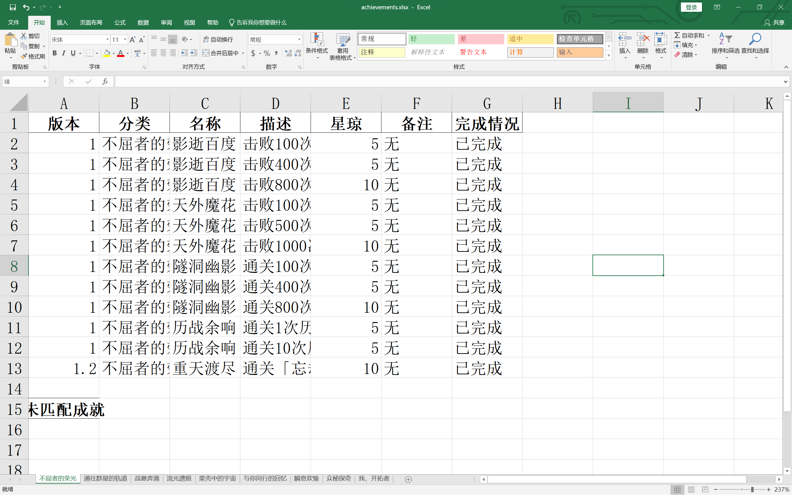

# starRailScanner——基于pyautogui的崩坏星穹铁道成就扫描脚本

## 目录

- [简介](简介)
- [适用范围](适用范围)
- [项目结构](项目结构)
- [使用方法](使用方法)
  - [环境配置](环境配置)
  - [版本检查](版本检查)
  - [参数设置](参数设置)
  - [运行脚本](运行脚本)
  - [运行结果](运行结果)
- [常见问题&问题反馈](常见问题&问题反馈)
- [未来计划](未来计划)
- [特别鸣谢](特别鸣谢)

## 简介

本脚本旨在通过pyautogui进行的模拟键鼠操作以及pytesseract提供的文本识别功能实现对崩坏 星穹铁道游戏中的成就列表的提取与整理。由于笔者前端实现能力较差（其实是比较懒）， 故而脚本通过python编译器在控制台中运行。

该项目此前曾提交过一个版本（~~但是已经被设置为private~~）,故而该版本提交为该项目的version 2.0。相较于原版本中完成所有成就读取才进行成就匹配的操作，该版本修正为完成部分成就（一般为5个）的读取后即进行成就的匹配，在一定程度上降低了内存的使用量。

项目灵感主要来源于[@椰羊CoCoGoat](https://github.com/YuehaiTeam/cocogoat)以及[@HertaSpace](https://github.com/YuehaiTeam/herta.space))，在此表示感谢。但是笔者希望可以通过本地操作避免视频数据或者批量图片的上传从而减轻网络负担，故而萌生了编写本地化脚本的想法。在椰羊CoCoGoat的启发下选择使用模拟键鼠操作进行截图处理并且使用文字识别从而完成图片中成就的读取。同时通过对静态化的图片而非视频进行ocr操作希望可以在一定程度上提高文字识别的精度。

## 适用范围

-[x] 2560\*1600

-[ ] 3840\*2160

-[ ] 1920*1080

由于笔者使用的PC设备的分辨率为2560\*1600，同时未对其余分辨率进行测试，故而当前该脚本可以适配的分辨率为2560\*1600，后续经过测试后将适配3840\*2160以及1920\*1080等PC端设备。

笔者在代码中普遍采用相对位置坐标进行编码，故而在截图点位选择上不会出现较大的变动，主要需要适配的数据包括在使用pyautogui提供的scroll函数时鼠标滚轮的次数。

以上提到的数据均在保存在config.py中，各位开拓者可以根据使用的PC端配置进行相应的修改或等待脚本的更新。

## 项目结构

项目中主要包含脚本编码文件以及当前版本的全成就列表（以.xlsx形式存储），下面为对各代码文件的简单描述。

|     文件名称      |                                 描述                                 |
| :---------------: |:------------------------------------------------------------------:|
|  checkPoints.py   |                    用于检测脚本运行环境，包括是否配置相关包以及设备分辨率                     |
|     config.py     |                   用于存储脚本运行相关参数，包括截图位置以及鼠标滚轮操作次数                    |
|      Main.py      |                        项目运行入口，组织并调用相应的函数操作                         |
|      ocr.py       |                      配置项目附带的pytesseract的调用参数                       |
|   operation.py    |                 pyautogui库相关操作，包括鼠标移动，鼠标滚轮滚动以及截图等                  |
|    process.py     |                   根据游戏操作逻辑进行成就集切换，并且连通ocr以及截屏操作                    |
|    selector.py    |                      基于cv2进行的成就逐条提取并保存为图片以供识别                      |
|     x.x.xlsx      |                     全成就列表，一般随游戏版本更新进行更新，以版本号命名                     |
| achievements.xlsx |                      读取完成产生的成就列表（**读取完成后产生**）                      |
|     tesseract     |                 存储tesseract库的组件（若在本地存在配置可以不下载该文件夹）                 |

同时项目中包含一个名为imgs的文件夹用于存储截图过程中产生的成就图片，**各位开拓者可以在config.py中将save_img设置为True以保存产生的截图以共上传到其他的成就在线读取工具中进行识别，或者选择将其设置为False，截图产生的图片将会在完成识别后被删除。**imgs中的存在对应于成就集的文件夹，由于成就集“我，开拓者”中逗号的存在到导致python在识别时产生错误编码的问题，故而采用英文命名。下面给出成就中文与图片存储文件夹的对照表。

| 成就集（中文） | 存储文件夹（英文） |
| :------------: | :---------------------------------------------------------: |
| 不屈者的荣光 | GloryOfTheUnyielding |
| 与你同行的回忆 | TheMemoriesWeShare |
| 众秘探奇 | FathomTheUnfathomable |
| 我，开拓者 | Trailblazer |
| 战意奔涌 | EagerForBattle |
| 果壳中的宇宙 | UniverseInANutshell |
| 流光遗痕 | VestigeOfLuminflux |
| 瞬息欢愉 | MonmentOfJoy |
| 通往群星的轨道 | TheRailUntoTheStar |

## 使用方法

### 环境配置

脚本基于pyhon3.9进行开发，在使用前需要检查python版本以避免无法使用。项目提供了相应的requirements.txt用于描述脚本使用的相关python库文件，使用前需要配置到运行环境中。

（由于调用的库较多，推荐使用anaconda或者miniconda等虚拟环境进行配置）

若使用pip直接安装或者在虚拟环境中使用pip安装：

```shell
pip install -r requirements.txt
```

若使用conda进行安装（不推荐）：

```shell
conda install --yes --file requirements.txt
```

项目文件中已经附带了相应的pytesseract文件，若在进行项目下载时下载了对应的文件夹则无需进行pytesseract的相关配置，若未下载相应的文件且系统环境变量中存在相应的文件同样无法进行相应的配置。

### 版本检查

由于部分时间笔者无法及时更新当前版本的全成就列表，故而可能存在当前版本的成就更新后无法及时识别的问题，开拓者们可以自行更新对应版本的全成就列表或者等待笔者更新捏。

### 参数设置

开拓者们可以根据自身需求以及设备的响应参数对config.py中的参数进行修改。config.py中主要包括下面的参数。

|     参数名      |                             描述                             |
| :-------------: | :----------------------------------------------------------: |
|    save_img     | Bool型变量，True为保存截图图片，False不保存截图图片，（**默认为True**） |
|     counts      | **不要修改该变量**，用于读取保存图片的文件夹中的文件数用于命名 |
|  SCROLL_VALUE   |     **谨慎修改该变量**，该变量用于控制鼠标滚轮滚动的次数     |
| TESSDATA_PREFIX |        **不要修改该变量**，用于配置tesseract配置文件         |
|  TESSDATA_PATH  |        **不要修改该变量**，用于配置tesseract配置文件         |
|      name       |     **不要修改该变量**，用于匹配中文成就集名称以及文件夹     |
|    location     | **谨慎修改该变量**，该变量用于标识截图的坐标信息（以相对坐标形式） |

### 运行脚本

完成配置后可以直接开始通过脚本读取成就集。脚本中提供两种成就集的读取方式。

**以下的代码需要在系统的管理员权限下执行。**

- 读取全成就集中的所有成就（610个成就读取约20分钟）

  ```shell
  python Main.py
  ```

  该操作主要用于初始化成就信息（第一次读取），形成对应的achievements.xlsx。

  **！！！该操作将直接覆盖原有的achievments.xlsx，请在读取前确认原有的成就清单已经保存或者确认可以进行覆盖！！！**

- 覆盖读取特定成就集中的成就（时间根据读取的成就数量而定）

  ```shell
  python Main.py <读取的成就集名（中文）> c
  ```

  该操作主要用于初始化成就信息（第一次读取），形成对应的achievements.xlsx。

  **！！！该操作将直接覆盖原有的achievments.xlsx，同时只保存一个成就集的对应数据，请在读取前确认原有的成就清单已经保存或者确认可以进行覆盖！！！**

- 替换读取特定成就集中的成就（时间根据读取的成就数量而定）

  ```shell
  python Main.py <读取的成就集名（中文）> u
  ```

  该操作主要替换achievements.xlsx中部分成就集的数据，将全成就更新替换为多次少量的更新。

  **！！！该操作将直接覆盖原有的achievments.xlsx中对应的成就集的信息，请在读取前确认原有的成就清单已经保存或者确认可以进行覆盖！！！**

（注：若输入了中文成就集名字但是未输入后续的参数，则默认使用替换的方式进行读取）

### 运行结果

脚本运行结束将产生下图中的提示：


脚本运行将生成对应的截图（若将参数save_img设置为Ture）与achievements.xlsx文件。

- 截图文件将以自然数顺序在对应的文件夹中命名并保存为.png格式，如下图所示：

  

- achievements.xlsx将保存按照中文成就集名字命名的工作表，工作表存在两种：

  - 成就集名：保存已经匹配的成就（同时包含完成与未完成的成就）

  - 成就集名(未匹配)：保存完成扫描但是未能匹配的成就

    未匹配的主要原因为tesseract在读取中文字符时出现的误差或fuzzywuzzy库在匹配算法中出现的误差，该部分需要各位开拓者根据未完成成就列表进行匹配。

下面为achievements.xlsx的部分截图：



## 常见问题&问题反馈

项目在测试过程中发现了以下的问题，欢迎各位开拓者在使用之后发现新的问题并进行反馈！

- 鼠标滚轮在成就集末尾出现异常抖动

  这是正常现象，由于脚本主要采用读取到重复成就名字作为读取完成的标志，故而在扫描接近结束时仍会向下滚动，这导致看起来类似于异常抖动。

- 读取的成就列表不完全

  造成该问题主要原因为鼠标滚轮操作数据并不精确，误差积累导致部分成就在滚动过程中被掩盖或者由于边界被遮盖导致的对应的成就并未被框选，故而导致了部分成就的缺失（该问题一般出现在单成就集成就数量≥80时），该问题将通过测试后更新对应的鼠标滚动数据得到解决。

- 运行时分辨率检测未通过

  查看设备当前的分辨率是否在脚本的适配列表中，若不在列表中则查看是否能切换设备的分辨率或者向笔者反馈并等待脚本适配新的设备参数。

- 脚本运行识别时出现乱码

  1. 检查设备的分辨率是否符合脚本适配列表要求
  2. 检查设备的缩放比例是否能使得界面充满整个电脑界面
  3. 修改config.py中的相对坐标以适配当前设备的要求
  4. 向笔者反馈并等待脚本适配新的设备参数。

- 脚本运行时长时间（一般指20-30s左右）无动作（如鼠标移动或页面滚动）

  检查脚本运行是否已经结束，若脚本运行仍未结束则立即最小化控制台页面以免影响下一次截图，若已经造成影响则应立即使用ctrl+C立即停止脚本。若脚本运行非正常结束，则检查脚本报错信息。

- 脚本运行时出现死循环（在成就集末尾出现多次鼠标滚动行为或者一直切换成就集）

  该部分的问题由于脚本是模拟键鼠操作并且获取了系统的管理员权限，所以解决较为困难。当问题出现时请尽可能的调出控制台并且使用ctrl+C结束脚本运行或者使用ctrl+alt+delete调出任务管理器终止脚本。若上述两种方式无法结束脚本运行则需要重启设备。

  该问题将在下个版本中解决，笔者将引入多线程用于监听键盘端输入以快速结束脚本的运行。

其余问题可以在该项目下的issues中进行反馈或者email至zhouwl.public@gmail.com与笔者联系！请在进行问题反馈时附带设备的分辨率参数以及屏幕的缩放倍率。感谢！

## 未来计划

~~（虽然有可能是咕咕咕的画饼）~~

- 实现对更多设备以及更多设备参数的适配
- 使用pynput或win32的模拟键鼠操作升级当前的脚本以实现后台进行成就扫描
- 基于tesseract或者easyOCR进行模型微调以提高中文字符识别的精度
- 实现多语言（主要是英语和日语）的适配

## 特别鸣谢

[@椰羊CoCoGoat](https://github.com/YuehaiTeam/cocogoat)

[@HertaSpace](https://github.com/YuehaiTeam/herta.space)