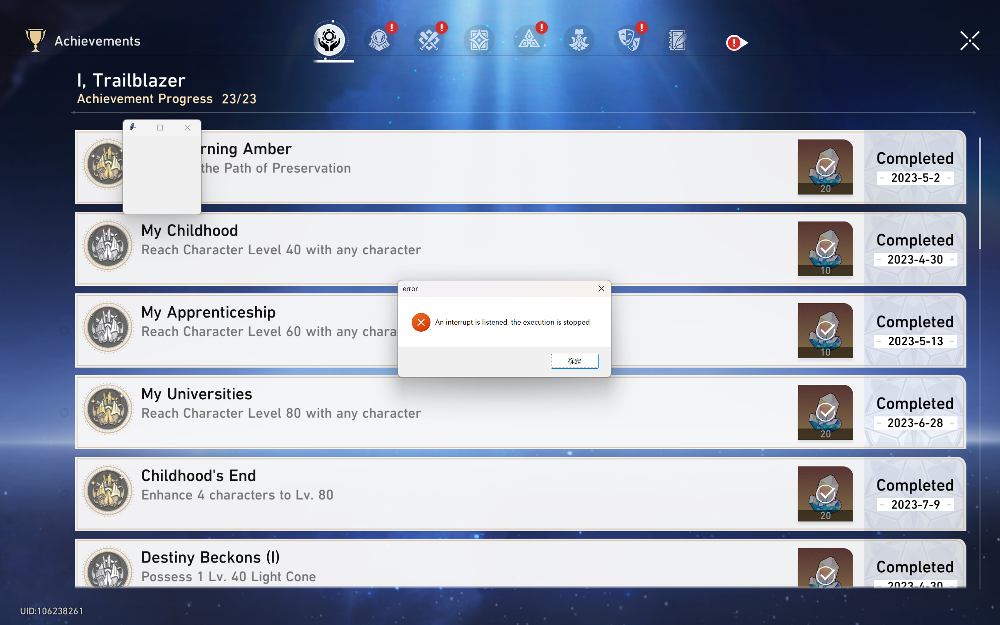
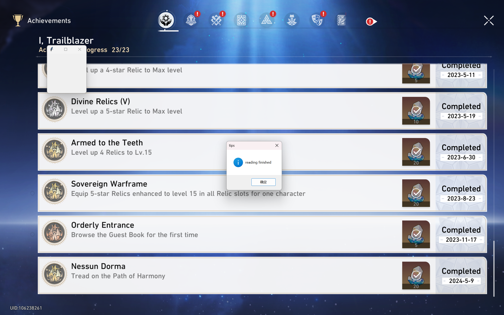
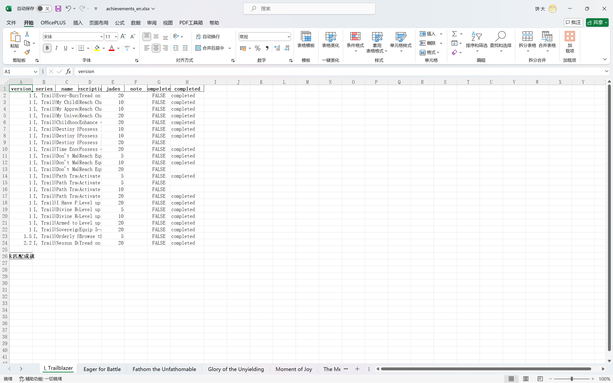

# StarRailScanner——A Script for Honkai Star Rail Achievement Scanning Based on pyautogui

## Project Iteration Records

- 2024-08-16
  - Updated the achievement set crawler. Currently supports crawling in Chinese, English and Japanese.
  - Updated the README documentation framework and added the crawler usage introduction.
  - Fixed the bug of matching immediately upon completion, improving recognition accuracy.
  - Create the README file in English.
  
- 2024-08-15
  - Fixed the function and error judgment when creating file directories.

- 2024-08-12
  - Achievement set file iteration, updated from version 2.2 to 2.4.
  - ~~Update announcement 1: Achievement set crawler is under development and will be tested online in the next version.~~ (Completed)
  - Update announcement 2: Learning to package .exe files. Release versions of .exe files will be released in subsequent versions.
  - Suspension announcement: Due to the author's preparations for exams, the subsequent update process may be longer. Apologies for this.

- 2024-05-28
  - Completed English recognition support for 2560\*1600 type devices.
  - Modified some selector code to reduce the probability of omissions during recognition.
  - Modified the project framework to adapt to future multilingual support, and modified related descriptions in config and README.
  
- 2024-05-19

  - Achievement set file iteration, updated from version 2.1 to 2.2.
  - Fixed the issue of path image quantity detection not passing due to Github not allowing empty folder uploads and creation.
  - Modified the description of the imgs folder architecture in README.

- 2024-04-18

  - Achievement set file iteration, updated from version 2.0 to 2.1.
  - Completed the matching of the project for 1920*1080 type devices.
  - Completed the multithreading implementation of the project for forced termination.

- 2024-04-02
  Project framework completed, first code submission, project documentation synchronized and submitted

## Directory
  * [Introduction](#introduction)
  * [Scope of Application](#scope-of-application)
  * [Project Structure](#project-structure)
  * [How to Use](#how-to-use)
    * [Environment Configuration](#environment-configuration)
    * [Version Checking](#version-checking)
    * [Parameter Settings](#parameter-settings)
    * [Run the Script](#run-the-script)
    * [Running Results](#running-results)
  * [Common Problems & Feedback](#common-problems-feedback)
  * [Future Plans](#future-plans)
  * [Special Thanks](#special-thanks)

## Introduction

This script aims to extract and organize the achievement list in the Honkai Star Rail game through simulated mouse and keyboard operations using pyautogui and text recognition capabilities provided by pytesseract. Due to the author's poor front-end implementation skills (actually, it's just laziness), the script runs in the console through the Python compiler.

This project had previously submitted a version (~~which was set to private~~), so this submission is version 2.0 of the project. Compared to the original version where all achievements were read before matching, this version has been corrected to perform achievement matching after reading a portion of achievements (usually 5), reducing memory usage to a certain extent.

The project is mainly inspired by [@椰羊CoCoGoat](https://github.com/YuehaiTeam/cocogoat) and [@HertaSpace](https://github.com/YuehaiTeam/herta.space)). Thank you for your inspiration. However, the author hopes to avoid uploading video data or batch images to reduce network burden through local operations, so the idea of writing a localized script was born. Inspired by CocoGoat, we chose to use simulated mouse and keyboard operations to perform screenshot processing and use text recognition to complete the reading of achievements from the images. At the same time, using static images instead of videos for OCR operations hopes to improve text recognition accuracy to a certain extent.

## Scope of Application

-[x] 2560\*1600 for Chinese

-[x] 2560\*1600 for English

-[X] 1920\*1080 for Chinese

-[X] 1920\*1080 for English

-[ ] 3840\*2160 for Chinese

-[X] 3840\*2160 for English

Since the author's PC device has a resolution of 2560\*1600 and other resolutions have not been tested, the current script can be adapted to resolutions of 2560\*1600. After testing, it will be adapted to 3840\*2160, 1920\*1080, and other PC devices.

The author generally uses relative position coordinates in the code, so there will not be significant changes in the screenshot point selection. The main data that needs to be adapted is the number of mouse wheel scrolls when using the scroll function provided by pyautogui.

The above data is stored in config.py. Pioneers can modify it according to their PC configuration or wait for script updates.

## Project Structure

The project mainly contains script coding files and the full achievement list of the current version (stored in .xlsx format). Here is a brief description of each code file.

|             File Name             |                         Description                          |
| :-------------------------------: | :----------------------------------------------------------: |
|           achievements            |           Used to store the read achievement list            |
|        achievementSet_full        | Used to store the full achievement list, including the languages currently supported by the script |
|          checkPoints.py           | Used to detect the script running environment, including whether related packages and device resolution are configured |
|             config.py             | Used to store script running parameters, including screenshot position and mouse wheel operation times |
|             crawl.py              |  Used to update the full achievement list from the web page  |
|         excelOperation.py         | Used to store excel related operations, including excel reading, writing, and column width operations |
|        KeyboardListener.py        | Import the keyboard listening component pynput to listen to keyboard input and stop the script operation |
|              Main.py              | Project running entry point, organizing and calling corresponding function operations |
|              ocr.py               | Configure the pytesseract call parameters included in the project |
|           operation.py            | pyautogui library related operations, including mouse movement, mouse wheel scrolling, and screenshotting |
|            process.py             | Perform achievement set switching according to the game operation logic, and connect OCR and screen capture operations |
|            selector.py            | Extract achievements one by one based on cv2 and save them as images for recognition |
|  achievementSet_full/x.x_().xlsx  | Full achievement list, named by version number, parentheses contain the corresponding language |
| achievements/achievements_().xlsx | Read completed achievement list, parentheses contain the language at the time of reading (**generated after reading is completed**) |
|             tesseract             | Stores the components of the tesseract library (if configured locally, you can skip downloading this folder) |

The project also includes a folder named imgs to store achievement images generated during the screenshot process. Pioneers can set save_img to True in config.py to save the generated screenshots for uploading to other online achievement reading tools for recognition, or set it to False to delete the images generated by the screenshots after recognition is completed. imgs contains folders corresponding to achievement sets. Due to the comma in the achievement set "Me, the Trailblazer", Python will encounter an error encoding problem during recognition, so English naming is used. Below is a table showing the correspondence between Chinese achievement names and the image storage folders.

| Achievement Set (Chinese) | Storage Folder (English) |
| :-----------------------: | :----------------------: |
|           temp            |           temp           |
|       不屈者的荣光        |   GloryOfTheUnyielding   |
|      与你同行的回忆       |    TheMemoriesWeShare    |
|         众秘探奇          |  FathomTheUnfathomable   |
|        我，开拓者         |       Trailblazer        |
|         战意奔涌          |      EagerForBattle      |
|       果壳中的宇宙        |   UniverseInANutshell    |
|         流光遗痕          |    VestigeOfLuminflux    |
|         瞬息欢愉          |       MonmentOfJoy       |
|      通往群星的轨道       |    TheRailUntoTheStar    |

Note: the temp directory is mainly used to temporarily store screenshots of achievement names in Chinese for judging which achievement set is being viewed and saving the images to the corresponding folders.

## How to Use

### Environment Configuration

The script was developed based on python3.9. Before using it, you need to check the Python version to avoid errors. The project provides a corresponding requirements.txt to describe the relevant Python library files used by the script. You need to configure them into the running environment before using them.

(Due to the use of multiple libraries, it is recommended to use a virtual environment like Anaconda or Miniconda for configuration)

If using pip to install directly or using pip in a virtual environment:

```shell
pip install -r requirements.txt
```

If using conda to install (not recommended):

```shell
conda install --yes --file requirements.txt
```

The project file already includes the corresponding pytesseract file. If you downloaded the corresponding folder when downloading the project, you don't need to configure pytesseract. If you haven't downloaded the corresponding file and the corresponding file exists in the system environment variables, you won't be able to configure it either.

### Version Checking

Due to the author's inability to update the full achievement list of the current version in a timely manner, there may be issues with the inability to recognize the achievements after the current version is updated. Pioneers can update the full achievement list of the corresponding version themselves or wait for the author to update it.

### Parameter Settings

Pioneers can modify the parameters in config.py according to their own needs and the response parameters of their device. config.py mainly includes the following parameters.

| Parameter Name     | Description                                                  |
| ------------------ | ------------------------------------------------------------ |
| language           | String type variable, representing the language used during reading (**Please ensure it matches the language in the game**) |
| save_img           | Bool type variable, True for saving screenshot images, False for not saving screenshot images (**default is True**) |
| ACHIEVEMENTS_FILE  | String type variable, representing the path of the complete achievement set, please use the latest achievement set after version update |
| counts             | **Don't modify this variable**, used to name the saved picture folder by counting the number of files |
| TESSDATA_PREFIX    | **Don't modify this variable**, used to configure the tesseract configuration file |
| TESSDATA_PATH      | **Don't modify this variable**, used to configure the tesseract configuration file |
| listener_stop_flag | Global variable, used to stop the listening process when forced to stop externally |
| main_stop_flag     | Global variable, used to stop the main process when forced to stop externally |
| name               | **Don't modify this variable**, used to match Chinese achievement set names and folders, automatically matches based on language |
| location           | **Don't modify this variable**, this variable is used to identify the coordinates of the screenshot (in relative coordinates) |
| location_list      | **Modify this variable cautiously**, this variable stores the coordinate information for identifying screenshots at different resolutions |

(Note: the language variable defaults to "ch", representing Chinese. If using English, change it to "en". According to tests, the accuracy of achievement reading is currently higher using English)

### Run the Script

------

This section is optional.

The script provides an operation for automating the update of the full achievement list using a crawler. Currently supported languages are Chinese, English, and Japanese. The update source URL is https://stardb.gg/zh-cn/achievement-tracker (Chinese), https://stardb.gg/en/achievement-tracker (English), https://stardb.gg/ja/achievement-tracker (Japanese). However, the method used by the crawler to obtain the full achievement list is to parse the HTML code of the corresponding page. This operation will be affected by the HTML code results. Therefore, if problems arise, please contact the author in a timely manner.

When performing update operations, please run the following code in the virtual environment.

```shell
python crawl.py
```

The updated full achievement list will be stored directly in the achievementSet_full folder.

------

After completing the configuration, you can directly start reading achievement sets using the script. The script provides two methods for reading achievement sets.

**The following code needs to be executed under administrator privileges on your system.**

- Read all achievements in the full achievement set (reading 610 achievements takes about 20 minutes)

  ```shell
  python Main.py
  ```

  This operation is mainly used to initialize achievement information (first read), forming the corresponding achievements.xlsx.

  **！！！ This operation will directly overwrite the existing achievements.xlsx. Please ensure that the existing achievement list has been saved or that you are sure you can overwrite it before reading！！！**

- Overwrite reading achievements in a specific achievement set (time depends on the number of achievements read)

  ```shell
  # Use in the case of using Chinese
  python Main.py <Name of the achievement set to be read (Chinese)> c
  # Use in the case of using English
  python Main.py "<Name of the achievement set to be read (English)>" c
  ```

  This operation is mainly used to initialize achievement information (first read), forming the corresponding achievements.xlsx.

  It is important to note that when reading in English, you need to enclose the achievement name in **double quotes**, otherwise the console will encounter recognition errors or default to no achievement set name being entered.

  **！！！ This operation will directly overwrite the existing achievements.xlsx, only saving the corresponding data of one achievement set. Please ensure that the existing achievement list has been saved or that you are sure you can overwrite it before reading！！！**

- Replace reading achievements in a specific achievement set (time depends on the number of achievements read)

  ```shell
  # Use in the case of using Chinese
  python Main.py <Name of the achievement set to be read (Chinese)> u
  # Use in the case of using English
  python Main.py "<Name of the achievement set to be read (English)>" u
  ```

  This operation mainly replaces the data of some achievement sets in achievements.xlsx. It replaces the full achievement update with multiple smaller updates.

  It is important to note that when reading in English, you need to enclose the achievement name in **double quotes**, otherwise the console will encounter recognition errors or default to no achievement set name being entered.

  **！！！ This operation will directly overwrite the information of the corresponding achievement set in the existing achievements.xlsx. Please ensure that the existing achievement list has been saved or that you are sure you can overwrite it before reading！！！**

(Note: If you enter a Chinese achievement set name but don't enter the subsequent parameters, it will default to using the replacement method for reading)

### Forced Stop of Execution

The latest version of the script has implemented external intervention for forced termination in case of misoperations. If you find that the script has entered an infinite loop, you can use ctrl+C to force the script to stop running. Since this operation is mainly based on keyboard listening and introduces an interrupt character in the loop operation, there may be a delay of 1-2 seconds after pressing ctrl+C. After successfully terminating the script, the following prompt will appear. The latest data read after the script execution is forcibly terminated will not be saved to achievement.xlsx.



### Running Results

The script will generate the following prompt when it finishes running:



The script execution will generate corresponding screenshots (if the parameter save_img is set to Ture) and achievements.xlsx files.

- Screenshot files will be named in natural number order in the corresponding folder and saved as .png format, as shown below:

  

- achievements.xlsx will save worksheets named after the Chinese achievement set names. There are two types of worksheets:

  - Achievement set name: save the achievements that have been matched (including both completed and incomplete achievements)

  - Achievement set name (unmatched): save achievements that were scanned but could not be matched

    The main reason for unmatched achievements is errors in tesseract's reading of Chinese characters or errors in the fuzzywuzzy library's matching algorithm. This part requires pioneers to match based on the list of incomplete achievements.

Here are some screenshots of achievements.xlsx:



## Common Problems & Feedback

The following problems have been discovered during testing. Welcome pioneers to provide feedback after using the script and discover new issues!

- Abnormal mouse wheel shaking at the end of the achievement set

  This is normal. Since the script mainly uses reading repeated achievement names as a sign of completion, it will continue to scroll down when the scan is nearing completion. This causes it to appear like abnormal shaking.

- The achievement list read is incomplete

  The main reason for this issue is that the mouse wheel operation data is not accurate. Errors accumulate, causing some achievements to be obscured during scrolling or some achievements not being selected due to the border being covered. This results in the loss of some achievements (this issue usually occurs when the number of achievements in a single achievement set is ≥80). This issue will be resolved by testing and updating the corresponding mouse wheel scroll data.

- Resolution detection failed during execution

  Check whether the current resolution of the device is in the script's adaptation list. If it is not in the list, check whether you can switch the device's resolution or provide feedback to the author and wait for the script to adapt to the new device parameters.

- Garbled characters appear during script execution and recognition

  1. Check whether the device resolution meets the requirements of the script's adaptation list
  2. Check whether the device's scaling ratio allows the interface to fill the entire computer screen
  3. Modify the relative coordinates in config.py to adapt to the requirements of the current device
  4. Provide feedback to the author and wait for the script to adapt to the new device parameters.

- Script execution has no action (such as mouse movement or page scrolling) for a long time (generally 20-30 seconds)

  Check whether the script execution has ended. If the script execution has not ended yet, minimize the console page immediately to avoid affecting the next screenshot. If it has already had an impact, you should immediately use ctrl+C to stop the script. If the script execution does not end normally, check the script error information.

- Script execution enters an infinite loop (multiple mouse wheel scrolling actions appear at the end of the achievement set or the achievement set keeps switching)

  This issue is difficult to resolve because the script simulates mouse and keyboard operations and has obtained administrator privileges on the system. When this issue occurs, try to bring up the console as much as possible and use ctrl+C to end the script execution, or use ctrl+alt+delete to bring up the task manager to terminate the script. If the above two methods cannot end the script execution, you need to restart the device.

  This issue will be resolved in the next version. The author will introduce multithreading to listen for keyboard input to quickly end the script execution.

  This issue has been resolved. See [Forced Stop of Execution](#Forced Stop of Execution) for the solution.

Other issues can be reported in the issues section under this project or emailed to [zhouwl.public@gmail.com](mailto:zhouwl.public@gmail.com) to contact the author! Please include the device resolution and screen zoom ratio when providing feedback. Thank you!

## Future Plans

(Although it may be a pie in the sky)

- Implement adaptation to more devices and device parameters
- ~~Upgrade the current script using pynput or win32 for simulated mouse and keyboard operations to achieve background achievement scanning~~(Due to simulated mouse and keyboard operations, background operations cannot be implemented)
- Fine-tune the model based on tesseract or easyOCR to improve the accuracy of Chinese character recognition
- Implement multilingual adaptation (mainly English and Japanese) (also provide README file)
- ~~Simplify the way to obtain the full achievement list. Obtain the full achievement list through crawling and other methods.~~(Completed)
- Update the stopping condition for achievement set scanning to improve accuracy.

## Special Thanks

[@椰羊CoCoGoat](https://github.com/YuehaiTeam/cocogoat)

[@HertaSpace](https://github.com/YuehaiTeam/herta.space)

[@tesseract](https://github.com/tesseract-ocr/tesseract)